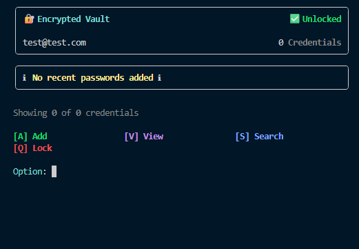
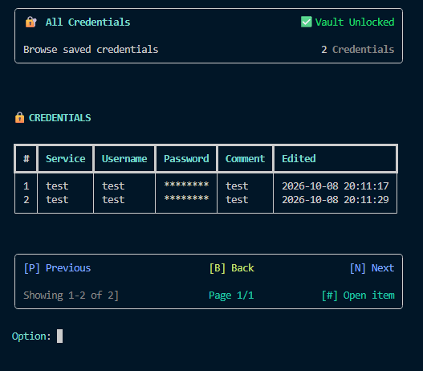

# AegisKey — Encrypted CLI Password Vault

AegisKey is a local command-line password vault built with Python, SQLite, Argon2id, Fernet, Rich, and pytest.


> AegisKey is a learning project and has not undergone an independent security audit. Do not treat it as a replacement for an audited production password manager.

## Overview

AegisKey is a terminal-based password manager with local user registration, authentication, encrypted credential-password storage, credential ownership checks, pagination, search, editing, deletion, and clipboard support.

The CLI is the first project milestone. The next phase is planned around a FastAPI REST API and a web interface while reusing the application and storage concepts developed in the CLI.

## Interface





## Features

### Authentication

- Local registration and login
- Email validation and duplicate-account prevention
- Master-password verification with Argon2id
- Separate salts for authentication and encryption-key derivation
- Session encryption-key derivation after successful authentication
- Per-user credential ownership

### Vault

- Add credentials
- Encrypt stored credential passwords with Fernet
- Mask passwords in normal list and detail views
- Reveal passwords only after explicit confirmation
- Copy revealed passwords to the system clipboard
- Edit Service, Username, Password, and Comment
- Delete credentials with confirmation
- Track creation and modification timestamps
- Sort credentials by Service and Username
- Show recent credentials on the main vault screen
- Five-item pagination
- Search by Service, Username, or Comment
- Partial and case-insensitive search
- Dedicated empty-vault and no-search-results states

### Security-related behavior

- Credential reads, edits, and deletes are scoped to the logged-in `UserID`
- User-controlled SQL values use SQLite parameters
- Stored credential passwords are encrypted before database insertion
- Password decryption failures are converted into controlled application errors
- Session references to the email, user ID, and encryption key are cleared on lock/logout
- New vault databases require credential Password, UserID, CreationDate, and EditedDate values

See [Security Model](docs/SECURITY_MODEL.md) for assumptions and limitations.

## Architecture

The current CLI uses a layered structure:

```text
Interface
   ↓
Core / Services
   ↓
Storage Logic
   ↓
Database Logic
   ↓
SQLite

Crypto and validation are used by the application/service layers where required.
```

See [Architecture](docs/ARCHITECTURE.md) for the detailed module responsibilities and application flows.

## Project structure

```text
src/
├── common/
│   ├── errors.py
│   └── helper_functions.py
├── core/
│   ├── login_logic.py
│   ├── main_logic.py
│   └── vault_logic.py
├── interface/
│   ├── add_interface.py
│   ├── edit_interface.py
│   ├── error_messages.py
│   ├── login_interface.py
│   ├── search_interface.py
│   ├── vault_interface.py
│   └── view_interface.py
├── services/
│   ├── add_items.py
│   ├── edit.py
│   ├── pagination.py
│   ├── search.py
│   └── view_items.py
├── storage/
│   ├── database_logic.py
│   └── storage_logic.py
├── crypto.py
├── validator.py
└── main.py

tests/
├── crypto/
├── login_logic/
├── services/
├── storage/
├── validator/
└── vault_logic/
```

## Technology stack

| Technology | Purpose |
|---|---|
| Python 3.14 | Application runtime |
| SQLite | Local persistent storage |
| cryptography | Fernet encryption |
| Argon2id | Master-password hashing and encryption-key derivation |
| Rich | CLI tables, panels, prompts, and formatting |
| InquirerPy | Interactive secret/password input |
| pyperclip | Clipboard integration |
| pytest | Automated testing |

## Installation

Python 3.14 is currently used for development.

```bash
git clone https://github.com/Timeless101/Encrypted-CLI-password-vault.git
cd Encrypted-CLI-password-vault
python -m pip install -r requirements.txt
```

Run from the repository root:

```bash
python -m src.main
```

The SQLite database is created automatically on first start.

## Running tests

Run the full suite:

```bash
python -m pytest
```

Detailed output:

```bash
python -m pytest -vv
```

## Security notes

AegisKey encrypts the credential **Password** field, but the SQLite database itself is not fully encrypted. Service names, usernames, comments, timestamps, account email addresses, password hashes, and salts are stored as database data.

Copied passwords remain in the operating-system clipboard until they are overwritten. This is an intentional v1.0 design choice.

Python does not provide guaranteed secure memory wiping, so clearing a Python variable does not guarantee that historical bytes are immediately removed from process memory.

For the complete security model, threat assumptions, reporting process, and known limitations, see:

- [SECURITY.md](SECURITY.md)
- [Security Model](docs/SECURITY_MODEL.md)

## CLI v1.0 status

The CLI feature set is complete and is in final release preparation.

Completed:

- Authentication and registration
- Add / View / Reveal / Copy
- Edit and Delete
- Pagination
- Search
- Credential ownership enforcement
- Crypto-failure handling
- Security and UX hardening
- Automated regression coverage for critical database/search/crypto behavior

Final release checks:

- Fresh-clone installation verification
- Full manual acceptance flow
- Final test run
- License selection
- `v1.0.0` tag and GitHub release

## Roadmap after CLI v1.0

Planned next phases:

- FastAPI REST API
- HTML/CSS/JavaScript web interface
- PostgreSQL
- Server-side authentication/session design
- Docker
- Deployment and operations work

## Design goals

- Keep UI code separate from application and storage logic
- Keep security-sensitive operations explicit and testable
- Avoid unnecessary abstractions
- Keep storage replaceable for future API/database work
- Reuse application concepts when moving beyond the CLI
- Prefer incremental, understandable engineering over premature complexity

## Contributing

Bug reports and architecture discussions are welcome.

Do not include real credentials, database files, encryption keys, master passwords, decrypted passwords, or other secrets in public issues, logs, screenshots, or pull requests.

For security vulnerabilities, follow [SECURITY.md](SECURITY.md) rather than opening a public issue.

## License

A license will be selected and added as part of the CLI v1.0 release preparation.

## Author

**Diego Wuck**

System Engineer building practical software, infrastructure, and cloud engineering skills through hands-on projects.
